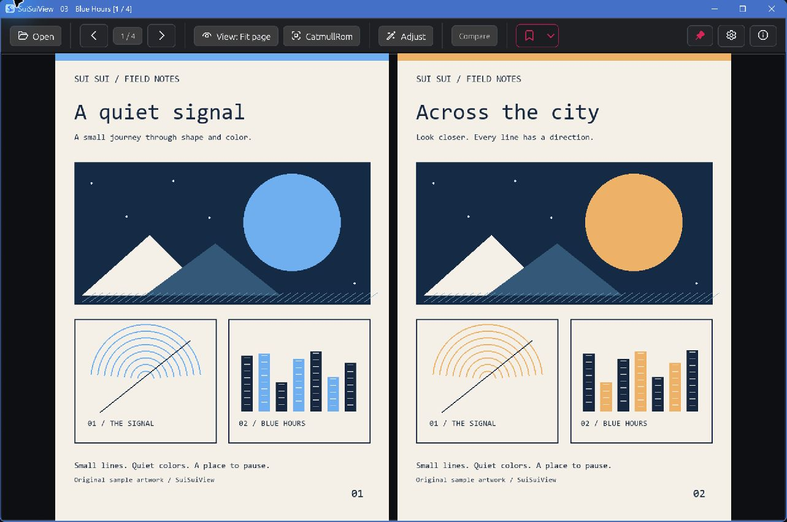

<div align="center">
  
  <h1>SuiSuiView — Image &amp; Comic Viewer for Windows</h1>
  <p><strong>Read local images and comics with the picture and controls you prefer.</strong></p>
  <p>
    
    
    
    
    
  </p>
</div>

Image and comic viewer for Windows with Anime4K and other GPU upscalers,
customizable controls, smart two-page reading, and ZIP/CBZ support.
Open image folders and read in single-page, two-page or continuous vertical view.

**한국어:** 화질부터 조작까지, 내 취향대로 보는 Windows 이미지·만화 뷰어.
SuiSuiView는 폴더·ZIP·CBZ를 열어 한 페이지·두 페이지·세로 연속 보기로 읽고,
Anime4K·CuNNy·ACNet 등의 확대 방식과 단축키·마우스 동작을 고를 수 있습니다.
GPU 업스케일링은 GPU 가속을 켜고 앱을 다시 시작한 뒤 화면 맞춤 모드에서
사용합니다. 앱 UI는 영어·한국어를 지원합니다.

## Availability

**Alpha — source builds only.** There are no public executable releases or
Microsoft Store listing yet. You can [build from source](#build-from-source)
and [report feedback on GitHub](https://github.com/BK927/SuiSuiView/issues).

Free GitHub executables and a paid Microsoft Store edition are planned around
the same core viewer. GitHub downloads will be updated manually; the Store
edition is intended to offer installation convenience and support continued
development. Store-managed updates depend on the final package. A release date
and price have not been announced. The free edition will not be a trial or a
feature-limited viewer.

현재는 소스 빌드로만 사용할 수 있는 Alpha 단계입니다. 무료 GitHub 실행 파일과
유료 Microsoft Store 배포는 준비 중이며, 두 경로에서 같은 핵심 뷰어를 제공할
계획입니다.



The reading samples were made for this project and opened in the actual app.

## Why SuiSuiView?

| Focus | What it means |
| --- | --- |
| Choose the enlargement | Use Anime4K v3.2 CNN x2 S/M, CuNNy or ACNet variants for fit-mode display enlargement with GPU acceleration. CPU upscale filters are also selectable. |
| Make the controls yours | Set keyboard and mouse bindings, choose top-bar scaler quick picks, and adjust scrolling and page-turn behavior. |
| Read local files | Open image folders, `.zip` and `.cbz` without unpacking them yourself; switch between single-page, two-page and vertical reading. |
| Keep your place | Reading progress and manual bookmarks use the contents of a ZIP/CBZ as its identity, so renaming or moving the same archive keeps them. |

GPU acceleration is optional and requires an app restart when switched. GPU
upscaling applies to fit-page, fit-width and fit-height enlargement, not every
manual zoom level. Results and processing cost depend on the image, settings
and hardware. ArtCNN options are experimental. Upscaling changes the displayed
image; it does not overwrite the original or export enlarged files.

The app also provides session-only rotation, flips, inversion, smoothing,
sharpening and gamma effects, plus per-format decoder preferences. These viewing
effects leave the source image unchanged.

## Build From Source

On Windows, install:

1. [Git for Windows](https://git-scm.com/downloads/win).
2. [Visual Studio Build Tools](https://visualstudio.microsoft.com/visual-cpp-build-tools/)
   with **Desktop development with C++**, including the MSVC C++ build tools and
   a Windows SDK. The default build compiles bundled native libraries as well as
   Rust code.
3. [Rust through rustup](https://www.rust-lang.org/tools/install), using the
   stable **MSVC** toolchain (`stable-x86_64-pc-windows-msvc` for Windows x64).

Open a new PowerShell window after installation, then run:

```powershell
git clone https://github.com/BK927/SuiSuiView.git
cd SuiSuiView
cargo run --release --locked
```

The first build downloads dependencies and can take several minutes. If the
linker or C++ tools cannot be found, use the **Developer PowerShell for Visual
Studio** installed with the build tools. The executable is created at
`target/release/suisuiview.exe` and can be opened directly after the build.

The default build includes still WebP decoding. Optional AVIF and
PDF-compatible Illustrator previews need additional dependencies and are not
enabled by this command. Use a release build when evaluating responsiveness.

Press `F2` / `Ctrl+O` to open an image or archive, or `F` to open a folder.
To try GPU upscaling, open Settings with `F5`, enable GPU acceleration in
Rendering, restart the app, then select an upscaler and a fit mode.

## Open And Read

- `F2` or `Ctrl+O`: open a file.
- `F`: open a folder.
- Drag and drop: open a file or folder directly.
- `PgDn`, `Down`, `Right`, or `Space`: next page.
- `PgUp`, `Up`, `Left`, `Backspace`, or `Shift+Space`: previous page.
- `1`, `9`, or `Z`: fit page.
- `8`: fit width.
- `7`: two-page left-to-right.
- `6`: two-page right-to-left.
- `F5`: settings.
- `F1`: app information and third-party open-source notices.

Right-click opens a context menu with common open, navigation, view, processing,
delete, copy, and window actions.

When `[` or `]` opens a neighboring book, the current view mode carries over if
that book does not already have a saved reading position.

## Supported Files

| Tier | Formats |
| --- | --- |
| Built in | Folders, single images, `.zip`, `.cbz`, `.jpg`, `.jpeg`, `.jpe`, `.jfif`, `.png`, `.apng`, `.webp`, `.bmp`, `.dib`, `.gif`, `.tif`, `.tiff`, `.tga`, `.pnm`, `.pbm`, `.pgm`, `.ppm`, `.ico`, `.qoi`, `.psd` |
| Experimental decoders included | `.dds`, `.exr`, `.hdr`, `.rgbe`; compatibility varies and HDR display output is not supported |
| Optional builds only | `.avif` with `native-avif`; PDF-compatible `.ai` first-page preview with `native-ai` and an app-local PDFium library |
| Not currently supported | `.jxl`, `.svg`, `.svgz`, `.heic`, `.heif`, `.hif`, `.jxr`, `.wdp`, `.hdp`, RAW/DNG camera formats, `.pdf`, `.rar`, `.cbr`, `.7z`, `.cb7`, `.clip`, `.bpg` |

PSD shows a flattened composite preview, not layers or Photoshop effects.
Optional `.ai` support does not add general PDF reading. Some unsupported file
extensions are recognized to explain why they cannot be opened; installing a
system codec does not currently enable HEIC or RAW viewing. Animated APNG, GIF,
and WebP files open as still previews; animation playback is not supported.

## Decoder Settings

Auto Fast selects the app's validated fast paths and falls back when needed.
Compatibility mode keeps the conservative baseline, and Custom mode lets you
override individual formats from Settings.

Still WebP support, including the native `libwebp` backend, is enabled by
default. AVIF and PDF-compatible `.ai` preview backends are optional and off by
default.

## Settings

`F5` opens the settings window. Settings and window state are saved to
`state.json`; each book's reading position and page bookmarks live in their own
per-book file.

- General: UI language, in-app delete confirmation, ESC exit, always-on-top,
  and first/last page behavior; Ask prompts auto-dismiss unless hovered.
- Rendering: transition effect, fast sampled/scaled decode, GPU
  acceleration, scaler/filter controls, EXIF orientation, embedded ICC
  conversion, prefetch, and a total memory budget (Saver/Standard/Ample presets,
  an automatic renderer-aware default, or a manual limit) with an estimate of
  cached display-image and GPU texture bytes. This is not total process RAM or
  physical VRAM usage. Manifest-backed SR Lab SPAN x2 is
  available as a slow manual GPU upscaler when local SPAN weights are present.
  Fixed 2x GPU SR upscalers skip tiny enlargements, can auto-stack once for
  large enlargement, and use the app's fixed WGPU downscaler when their 2x/4x
  output is larger than the final display size. CPU downscaling uses the fixed
  CatmullRom filter; WGPU downscaling uses Pyramid Lanczos3. These downscale
  algorithms are not user-selectable in normal settings. GPU debanding and
  linear-light downscaling can be enabled separately.
- Decoders: decode mode and per-format decoder choices. `기본값` is shown as
  selected text, with the resolved backend summarized beside each format.
- File links: on Windows, register SuiSuiView as a Default Apps candidate for
  selected image and comic file types.
- View, keyboard, and mouse: visible viewer UI, top-bar scaler quick picks,
  customizable keyboard shortcuts, double-click maximize, middle-click
  fullscreen, and wheel behavior.

Fast sampled/scaled decode is enabled by default. It lets large JPEG, WebP,
PNG, BMP, and GIF pages use format-specific display-sized preparation before
falling back to full decode plus the app's fixed CPU downscale filter.

The UI language can be set to system default, Korean, or English. UI text and
state words such as Default, Off, and Experimental are localized, while
technical names such as JPEG and ZIP/CBZ stay in English.

## Bookmarks And State

The bookmark list and its total count load in the background. Loading thumbnails
show a spinner, and search edits reuse the loaded list. Next/previous-file
discovery and file reading also run in the background, with an opening indicator
while the current page remains visible. A sleeping or busy disk can still delay
the result; image quality and the bookmark storage format are unchanged.

Rapid next/previous-file taps are kept in order and shown one book at a time.
Releasing a held key cancels its queued automatic repeats; separate taps remain
queued and may finish after release. While another book is opening or reserved,
the current book's off-screen page prefetch pauses. First-page preparation uses
the destination book's saved view and the active renderer's decode policy so a
compatible prepared image can be reused. These paths keep the existing image
quality and image-cache budgets.

Page requests reuse compatible reads that have already finished. Prefetch checks
whether prepared pixels still exist, and completed pages waiting for the UI have
a byte limit that also covers deferred processing. Navigation and shutdown
commands remain available while delivery waits for room. A single page larger
than that limit can still be delivered to preserve display quality.

State is saved to the platform data directory. On Windows this resolves to an
AppData `SuiSuiView/` folder: `state.json` holds settings and window state, and
each book's data lives in its own file under `books/`.

Two things are remembered per book:

- Reading position ("이어보기"/resume) is saved automatically as you turn pages,
  so reopening a book returns to where you left off. It can be disabled in
  settings.
- Manual page bookmarks are toggled explicitly and listed in the bookmark
  popover.

For ZIP and CBZ files, the per-book key is based on archive contents, not the
archive path, so moving or renaming the same archive keeps your place and its
bookmarks.

- `B`: toggle a bookmark for the current page.
- `Ctrl+B`: open the bookmark popover.

View effects are intentionally not saved. Opening or closing a book resets
rotation, flips, filters, gamma, and inversion.

## Delete And Clipboard

- `Delete`: move the current file to the Recycle Bin.
- `Shift+Delete`: permanently delete after confirmation.
- `Ctrl+Enter`: reveal the current file.
- `Ctrl+C`: copy the current page image.
- `Ctrl+Alt+C`: copy the visible spread image.
- `Ctrl+Alt+Shift+C`: copy the page path.

Delete actions operate on real files only. For ZIP and CBZ, the delete target is
the whole archive file, never an internal page. For folders and single images,
the target is the current image file.

For ZIP and CBZ books, copied page paths use a virtual form such as
`book.cbz::chapter/page001.jpg` because archive-internal pages are not
standalone files.

## Roadmap

- [x] Native image and comic viewer.
- [x] Folder, ZIP, and CBZ support.
- [x] Path-independent ZIP/CBZ bookmarks.
- [x] Large-image preview, cache, and display preparation.
- [x] Display effects, fit-mode upscaling, and user-selectable decoders.
- [x] Current-page EXIF, file, and color information.
- [ ] CBR/RAR and 7Z/CB7 read-only archive support.
- [x] Webtoon-style continuous vertical reading mode.
- [ ] Folder and page thumbnail overview for faster navigation.
- [x] Smarter Auto upscaler selection for content-aware fit-mode enlargement
  (per-book round-trip probe: each book's own pixels pick the winner once,
  cached in the book record).
- [ ] Modern format expansion, including JPEG XL, HEIC/HEIF, SVG, JPEG XR,
  and broader RAW preview support.
- [ ] Clip Studio Paint (`.clip`) flattened preview, reusing the same
  embedded-preview path as PSD.
- [ ] Show AI generation metadata (Stable Diffusion prompt / `parameters`)
  in the current-page info panel when present.
- [ ] Loupe (magnifier) mode: zoom a region under the cursor without
  changing the overall fit or zoom.
- [ ] Session-only brightness and contrast adjustment for dark or aged
  scans, alongside the existing gamma, sharpen, and smooth effects.
- [ ] Printing, slideshow, and external editor workflows.
- [ ] Long-term: HDR display output for HDR-capable formats and monitors.

<details>
<summary>Keyboard And Mouse Reference</summary>

### Open And Window

- `F2` or `Ctrl+O`: open a file.
- `F`: open a folder.
- `F4`: close the current book.
- `Esc`: close an open settings or information window first; otherwise exit
  when enabled in settings. While recording a shortcut, cancel recording first.
- `X` or `Ctrl+W`: exit.
- `F11`, `Alt+Enter`, or `N`: fullscreen.
- `M`: maximize or restore.
- `Q`: minimize.
- `Ctrl+A`: always on top.

### Page Movement

- `PgDn`, `Down`, `Right`, or `Space`: next page.
- `PgUp`, `Up`, `Left`, `Backspace`, or `Shift+Space`: previous page.
- `Home` / `End`: first or last page.
- `Ctrl+PgDn` / `Ctrl+PgUp`: jump 10 pages.
- `Ctrl+Shift+Right` / `Ctrl+Shift+Left`: jump 100 pages.
- `Shift+PgDn` / `Shift+PgUp`: force a one-page move in two-page mode.
- `Ctrl+Alt+PgDn` / `Ctrl+Alt+PgUp`: random page.
- `]` / `[`: open the next or previous folder, ZIP, or CBZ beside the current
  book. The current view mode carries over when the target book has no saved
  reading position.

### View

- `0` or `*`: original size.
- `1`, `9`, or `Z`: fit page.
- `8`: fit width.
- `7`: two-page left-to-right.
- `6`: two-page right-to-left.
- `2`: toggle two-page mode.
- The view selector also includes fit height.
- `+` / `-`: zoom in or out.
- `Ctrl++` / `Ctrl+-`: change zoom by 1%.

### Display Effects

- `Ctrl+I`: invert colors.
- `Ctrl+M`: flip horizontal.
- `Ctrl+F`: flip vertical.
- `Ctrl+L` / `Ctrl+R`: rotate left or right.
- `Alt+Up`, `Alt+Left`, `Alt+Right`, `Alt+Down`: set rotation.
- `U`, `I`, `S`: change display filter.
- `Ctrl+G`: toggle gamma correction.

The top-bar compare toggle splits the current page into A/B panes. Its choices
are the current app preparation, selected CPU filters, and the listed WGSL
Bilinear, FSR-style, FSR1 EASU+RCAS and NIS-style options. Anime4K, CuNNy and
ACNet are not directly selectable as A/B targets; compare those by changing
the normal GPU upscaler on the same page and fit mode.

### Mouse

- Drag to pan.
- Mouse wheel moves pages by default.
- `Ctrl+mouse wheel`: zoom.
- Double-click: maximize or restore.
- Middle-click: fullscreen.
- `Ctrl+middle-click`: return to 100%.

</details>

## Optional Stall Diagnostics

Support builds compiled with `--features stall-diagnostics` can record slow
operations locally when `SUISUIVIEW_STALL_LOG` names a new absolute output file.
Create its parent directory first. Without that environment variable, diagnostics
stay off; default builds compile the instrumentation out entirely.

Close all running SuiSuiView windows before starting a diagnostic session. If
your support build includes `start-stall-diagnostics.cmd`, double-click it beside
`suisuiview.exe`, use the viewer normally, then close the viewer. Its
`stall-diagnostics` folder contains the new report. Starting the executable
directly returns to normal operation without recording.

The report contains fixed operation names, UI/background roles and relative
timings, plus session and dropped-sample markers. It excludes file names, paths,
book IDs, page numbers, settings, image contents and error text. Nothing is
uploaded. Completed operations taking at least 100 ms are recorded; an independent
worker also samples operations still running after one second. Each session is
limited to 2 MiB. Existing reports are never overwritten. Use an SSD destination
when investigating HDD idle/wake behavior so diagnostic writes do not wake that HDD.
These timings identify where time was spent; a slow background operation alone
does not establish that the UI was unresponsive.

## License

SuiSuiView is licensed under `GPL-3.0-only`. See [LICENSE](./LICENSE) and
[third-party notices](./THIRD_PARTY_NOTICES.txt). The planned free GitHub and
paid Microsoft Store editions use the same core open-source viewer; neither
executable distribution is publicly available yet. See [Availability](#availability).
