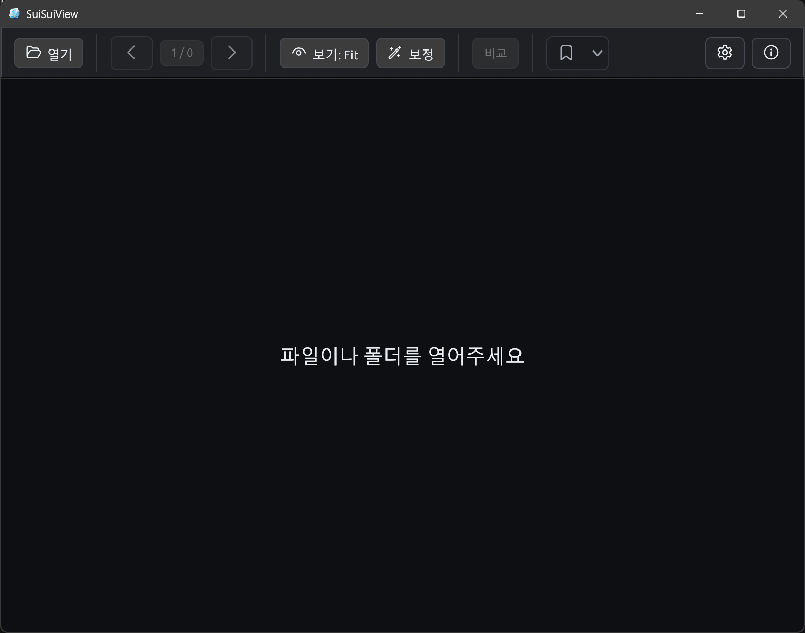

<div align="center">
  
  <h1>SuiSuiView</h1>
  <p><strong>Fast, lightweight native image and comic viewer for folders, ZIP, and CBZ.</strong></p>
  <p>
    
    
    
    
    
  </p>
</div>

SuiSuiView is built for people who want image folders and comic archives to open
quickly, turn pages smoothly, and remember their place without feeling like a
full media-management suite.



## Why SuiSuiView?

| Focus | What it means |
| --- | --- |
| Fast reading | Background decode, display-sized preparation, nearby-page cache, and lightweight transitions. |
| Comic friendly | Folder, `.zip`, and `.cbz` support with single-page and two-page spread modes. |
| Stable bookmarks | ZIP/CBZ bookmarks are based on book contents, so moving or renaming a book should keep your place. |
| Tunable decoders | Auto Fast uses the app default fast paths, compatibility mode keeps the broad `image` baseline, and custom mode lets you override per-format decoders. |
| Tunable scaling | Separate CPU and WGPU scaler choices let display preparation stay light while GPU rendering can use quality-first downscaling. |
| Safe viewing tools | Rotate, flip, invert, smooth, sharpen, and gamma effects are session-only and never rewrite the source image. |

## Quick Start

If you are running SuiSuiView from the source tree:

```powershell
cargo run --release
```

Release builds are the right way to judge page-turn and image-decode
responsiveness.

## Open And Read

- `F2` or `Ctrl+O`: open a file.
- `F`: open a folder.
- Drag and drop: open a file or folder directly.
- `PgDn`, `Down`, `Right`, or `Space`: next page.
- `PgUp`, `Up`, `Left`, `Backspace`, or `Shift+Space`: previous page.
- `1`, `9`, or `Z`: fit page.
- `8`: fit width.
- `7`: two-page left-to-right.
- `6`: two-page right-to-left.
- `F5`: settings.
- `F1`: app information and third-party open-source notices.

Right-click opens a context menu with common open, navigation, view, processing,
delete, copy, and window actions.

When `[` or `]` opens a neighboring book, the current view mode carries over if
that book does not already have a saved reading position.

## Supported Files

| Tier | Formats |
| --- | --- |
| Built in | Folders, single images, `.zip`, `.cbz`, `.jpg`, `.jpeg`, `.jpe`, `.jfif`, `.png`, `.apng`, `.webp`, `.bmp`, `.dib`, `.gif`, `.tif`, `.tiff`, `.tga`, `.pnm`, `.pbm`, `.pgm`, `.ppm`, `.ico`, `.qoi`, `.psd` |
| Optional or experimental | `.dds`, `.exr`, `.hdr`, `.rgbe`, `.jxl`, `.svg`, `.svgz`, `.avif`, `.ai` |
| Recognized but not opened yet | `.heic`, `.heif`, `.jxr`, RAW/DNG camera formats |

Some recognized formats are preview-only or available only in optional builds.
PSD and PDF-compatible `.ai` files show flattened previews only. Unsupported
formats show a clear message instead of opening.

## Decoder Settings

Auto Fast selects the app's validated fast paths and falls back when needed.
Compatibility mode keeps the conservative baseline, and Custom mode lets you
override individual formats from Settings.

Optional builds can enable extra WebP, AVIF, and PDF-compatible `.ai` preview
backends. They are off by default.

## Settings

`F5` opens the settings window. Settings are saved with bookmarks in the app
state file.

- General: UI language, delete confirmation, ESC exit, always-on-top, and
  first/last page behavior; Ask prompts auto-dismiss unless hovered.
- Rendering: transition effect, fast sampled/scaled decode, GPU
  acceleration, scaler/filter controls, EXIF orientation, embedded ICC
  conversion, prefetch, and cache memory.
- Decoders: decode mode and per-format decoder choices. `기본값` is shown as
  selected text, with the resolved backend summarized beside each format.
- File links: on Windows, register SuiSuiView as a Default Apps candidate for
  selected image and comic file types.
- View, keyboard, and mouse: visible viewer UI, top-bar scaler quick picks,
  customizable keyboard shortcuts, double-click maximize, middle-click
  fullscreen, and wheel behavior.

Fast sampled/scaled decode is enabled by default. It lets large JPEG, WebP,
PNG, BMP, and GIF pages use format-specific display-sized preparation before
falling back to full decode plus the selected CPU downscale filter.

The UI language can be set to system default, Korean, or English. UI text and
state words such as Default, Off, and Experimental are localized, while
technical names such as JPEG and ZIP/CBZ stay in English.

## Bookmarks And State

Bookmarks and viewer preferences are saved to the platform data directory. On
Windows, this resolves to an AppData `SuiSuiView/state.json` location.

For ZIP and CBZ files, the bookmark key is based on archive contents, not the
archive path. Moving or renaming the same archive should keep the bookmark.

- `B`: toggle a bookmark for the current page.
- `Ctrl+B`: open the bookmark popover.

View effects are intentionally not saved. Opening or closing a book resets
rotation, flips, filters, gamma, and inversion.

## Delete And Clipboard

- `Delete`: move the current file to the Recycle Bin.
- `Shift+Delete`: permanently delete after confirmation.
- `Ctrl+Enter`: reveal the current file.
- `Ctrl+C`: copy the current page image.
- `Ctrl+Alt+C`: copy the visible spread image.
- `Ctrl+Alt+Shift+C`: copy the page path.

Delete actions operate on real files only. For ZIP and CBZ, the delete target is
the whole archive file, never an internal page. For folders and single images,
the target is the current image file.

For ZIP and CBZ books, copied page paths use a virtual form such as
`book.cbz::chapter/page001.jpg` because archive-internal pages are not
standalone files.

## Roadmap

- [x] Native image and comic viewer.
- [x] Folder, ZIP, and CBZ support.
- [x] Path-independent ZIP/CBZ bookmarks.
- [x] Large-image preview, cache, and display preparation.
- [x] Display effects, fit-mode upscaling, and user-selectable decoders.
- [x] Current-page EXIF, file, and color information.
- [ ] CBR/RAR and 7Z/CB7 read-only archive support.
- [ ] Webtoon-style continuous vertical reading mode.
- [ ] Folder and page thumbnail overview for faster navigation.
- [ ] Smarter Auto upscaler selection for content-aware fit-mode enlargement.
- [ ] Modern format expansion, including JPEG XL, HEIC/HEIF, SVG, JPEG XR,
  and broader RAW preview support.
- [ ] Printing, slideshow, and external editor workflows.

<details>
<summary>Keyboard And Mouse Reference</summary>

### Open And Window

- `F2` or `Ctrl+O`: open a file.
- `F`: open a folder.
- `F4`: close the current book.
- `Esc`, `X`, or `Ctrl+W`: exit.
- `F11`, `Alt+Enter`, or `N`: fullscreen.
- `M`: maximize or restore.
- `Q`: minimize.
- `Ctrl+A`: always on top.

### Page Movement

- `PgDn`, `Down`, `Right`, or `Space`: next page.
- `PgUp`, `Up`, `Left`, `Backspace`, or `Shift+Space`: previous page.
- `Home` / `End`: first or last page.
- `Ctrl+PgDn` / `Ctrl+PgUp`: jump 10 pages.
- `Ctrl+Shift+Right` / `Ctrl+Shift+Left`: jump 100 pages.
- `Shift+PgDn` / `Shift+PgUp`: force a one-page move in two-page mode.
- `Ctrl+Alt+PgDn` / `Ctrl+Alt+PgUp`: random page.
- `]` / `[`: open the next or previous folder, ZIP, or CBZ beside the current
  book. The current view mode carries over when the target book has no saved
  reading position.

### View

- `0` or `*`: original size.
- `1`, `9`, or `Z`: fit page.
- `8`: fit width.
- `7`: two-page left-to-right.
- `6`: two-page right-to-left.
- `2`: toggle two-page mode.
- The view selector also includes fit height.
- `+` / `-`: zoom in or out.
- `Ctrl++` / `Ctrl+-`: change zoom by 1%.

### Display Effects

- `Ctrl+I`: invert colors.
- `Ctrl+M`: flip horizontal.
- `Ctrl+F`: flip vertical.
- `Ctrl+L` / `Ctrl+R`: rotate left or right.
- `Alt+Up`, `Alt+Left`, `Alt+Right`, `Alt+Down`: set rotation.
- `U`, `I`, `S`: change display filter.
- `Ctrl+G`: toggle gamma correction.

The top-bar compare toggle can split the current page into A/B panes. Each side
can use the app default, CPU scaler filters, or a WGSL display upscaler.

### Mouse

- Drag to pan.
- Mouse wheel moves pages by default.
- `Ctrl+mouse wheel`: zoom.
- Double-click: maximize or restore.
- Middle-click: fullscreen.
- `Ctrl+middle-click`: return to 100%.

</details>

## License

SuiSuiView is licensed under `GPL-3.0-only`. The free GitHub release and the
paid Microsoft Store release are built around the same open-source viewer; the
Store release pays for official Store distribution, signed installation, and
Microsoft Store automatic updates.
